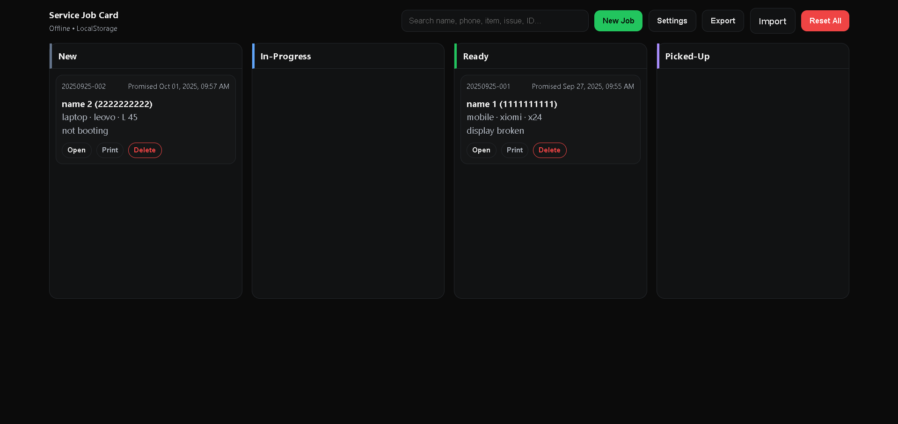

# Service Job Card



Tiny, offline-first web app to create/track repair/service job tickets with printable receipts.

**Live:** https://a2rp.github.io/service-job-card/  
**Code:** https://github.com/a2rp/service-job-card

## Features

-   New job intake → auto ID (`YYYYMMDD-###`)
-   Kanban board: New / In-Progress / Ready / Picked-Up
-   Live totals: **Total (₹)** and **Balance (₹ = Total − Advance)**
-   Print ticket (A5/A6 friendly), shop details in header
-   Search, Export/Import (JSON), LocalStorage-only

## Stack

HTML + SCSS + JavaScript (vanilla). No backend, no frameworks.

## Quick Start

```bash
# 1) Clone
git clone https://github.com/a2rp/service-job-card.git
cd service-job-card

# 2) Compile SCSS → CSS (install Sass if needed: npm i -g sass)
sass --watch style.scss style.css

# 3) Run
# Open index.html in your browser (or use Live Server)
```
